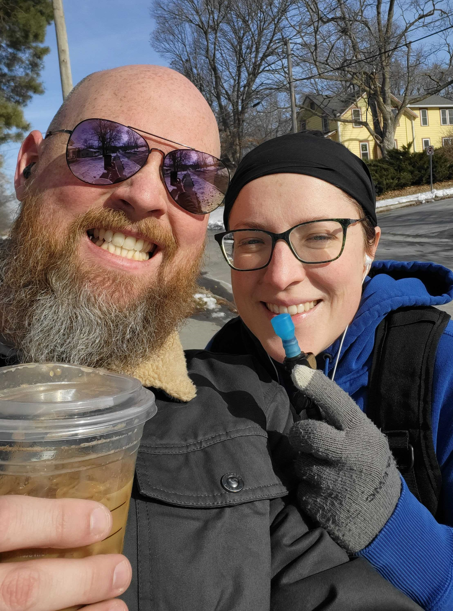

# Why your SMART Goals aren’t Working: The Key to More Successful Projects

Recently, my husband and I were eating lunch at our kitchen island on an unseasonably warm Saturday afternoon in February. We decided we should take advantage of the 45 degree day in the middle of an Iowa winter to go on a walk. We agreed that we’d head to a park about a 30 minute walk from our house after we cleaned up from lunch. 

When we meet up by our front door, my husband is wearing jeans, his new winter coat he got for Christmas, and carrying a grande iced coffee from Starbucks ready for a nice leisurely stroll. I’m wearing workout clothes, a 10+ year old sweatshirt and a literal backpack full of water ready to sweat. Needless to say neither of us got the walk we were expecting. The pace was slower than I anticipated but fast enough that my husband dropped his Starbucks cup and we changed our route to go get him a new one. 

A common measure of goal quality is the SMART goal system. Goals need to meet 5 criteria by being Specific, Measurable, Achievable, Relevant, and Time-bound. Let’s see how our goal held up:
- Specific: We were clear that we were going on a walk together because it was unseasonably warm and we set a destination (the local park). 
- Measurable: We agreed to the distance (to the park and back).
- Achievable: I’ve walked to this park and back many times, so I know it is an achievable distance for the amount of time we had. 
- Relevant: We agreed on a time that made sense to both of us. It was a nice day outside and the unseasonably warm temperature made it great for walking.
- Time-bound: We had plans that evening, so we knew we had to be back by a specific time. 

We had a SMART goal. So where did we go wrong? 

We didn’t dive deeply enough into **why** we wanted to go on a walk. What purpose were we trying to achieve? I wanted to get some exercise. I had a step goal to hit. My husband wanted to enjoy the nice weather and spend some relaxing time outside while listening to an audiobook.

So what does this have to do with technology consulting?

Source Allies is an AWS certified partner. We frequently work with partners who have a goal to migrate to the cloud. They generally have a certain number of servers they want to migrate and a timeframe they want to migrate in. On the surface this might seem like a good project goal. 

But we don’t stop there. That goal doesn’t tell us why the partner wants to migrate. If we have to make tradeoffs throughout the project, there is no guidance to use when making them. So we start asking our partners why and we don’t stop until we understand the root cause. 

You may be familiar with the Lean concept of the [5 whys](https://www.lean.org/lexicon-terms/5-whys/). This is a concept created by the founder of Toyota in the 1930’s. It involves asking the question why 5 times to get to the root cause of an issue. When applied to goal setting for a cloud migration, it can look something like this:

#### Why do you want to partner with Source Allies?
> We would like to migrate our servers to the cloud.

#### Why do you want to migrate to the cloud?
> We want more reliable infrastructure.

#### Why do you need more reliable infrastructure?
> We’ve had multiple outages that have cost hundreds of thousands of dollars due to the time it takes to resolve them.

#### Why did it take so long to resolve those outages?
> We didn’t have tools, knowledge, or processes in place to quickly resolve an outage.

Notice I didn’t ask why 5 times. The specific number isn’t important. We just need to get to the heart of the issue. Now we know that the cloud migration is not successful if we don’t leave the partner with the tools, knowledge and processes to resolve outages quickly. 

You may be tempted to stop asking why once you tell them that reliability is a goal.  This can lead to confusion. There are architecture decisions that can improve reliability (like using multiple availability zones), but this doesn’t address the root cause. 

By asking why a couple more times, we know that we need to focus on the tools, knowledge, and processes needed to successfully resolve an outage. We will prioritize monitoring tools, playbooks and runbooks in our project plan. We know that the team needs to be trained to use these tools effectively and understand the importance of keeping them up to date. 

If we have to make important decisions about the scope or timeline of the project, we know not to sacrifice when it comes to tools, knowledge, or processes that lead to greater reliability. And when an outage inevitably happens, the partner is prepared with the tools, knowledge, and processes to resolve it in a timely manner. 

So the next time you start a project, ask yourself if you know why the team wants to complete the project. And don’t be afraid to ask why a few more times after that. Having clear expectations about not only what you want to achieve but why you want to achieve it is essential for success. Once you know the true purpose, you will likely see that your goal wasn’t all that SMART to begin with. 

### References:

https://www.mindtools.com/a3mi00v/5-whys

https://sixsigmadsi.com/smart-goals/

https://www.lean.org/lexicon-terms/5-whys/

